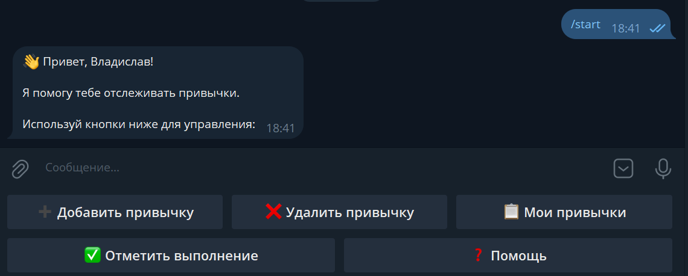
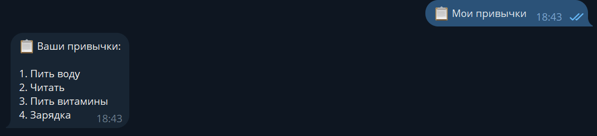
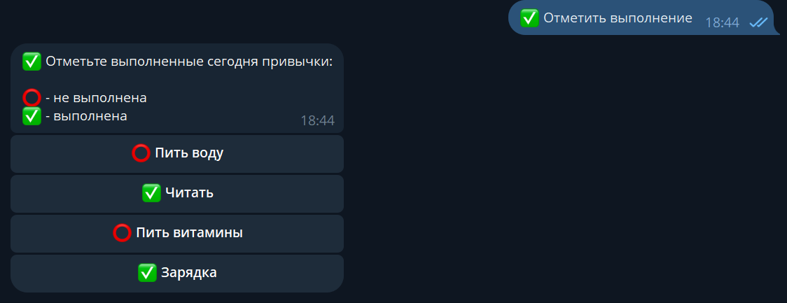

# 📊 Habit Tracker Bot

Telegram-бот для отслеживания ежедневных привычек с интуитивным интерфейсом на кнопках.


## 📖 Описание

Бот помогает формировать и отслеживать полезные привычки. Простой и удобный интерфейс с кнопками делает использование максимально комфортным. Все данные хранятся в локальной базе данных SQLite.

## ✨ Возможности

- ➕ **Добавление привычек** - создание новых привычек для отслеживания
- 📋 **Список привычек** - просмотр всех активных привычек
- ✅ **Отметка выполнения** - быстрая отметка выполненных привычек
- ❌ **Удаление привычек** - удаление ненужных привычек
- 🎯 **Интуитивный интерфейс** - управление через удобные кнопки

### 👨🏻‍💻 Soon...
- 🔥 **Streak отслеживание** - подсчёт дней подряд выполнения
- 📊 **Статистика** - общая статистика по всем привычкам
- 📅 **История** - календарь выполнений за месяц


## 🚀 Быстрый старт

### Требования

- Python 3.10 или выше
- pip (менеджер пакетов Python)

### Установка

1. **Клонируйте репозиторий:**
```bash
git clone https://github.com/zefnn/habit-tracker-bot.git
cd habit-tracker-bot
```

2. **Создайте виртуальное окружение:**
```bash
python -m venv venv

# Активация (Linux/Mac):
source venv/bin/activate

# Активация (Windows):
venv\Scripts\activate
```

3. **Установите зависимости:**
```bash
pip install -r requirements.txt
```

4. **Создайте файл `.env` с токеном бота:**
```bash
BOT_TOKEN=your_bot_token_here
```

Получить токен можно у [@BotFather](https://t.me/BotFather) в Telegram:
- Отправьте команду `/newbot`
- Следуйте инструкциям
- Скопируйте полученный токен в `.env`

5. **Запустите бота:**
```bash
python main.py
```

## 📱 Использование

### Команды

- `/start` - Запуск бота и отображение главного меню

### Кнопки управления

- **➕ Добавить привычку** - Создать новую привычку для отслеживания
- **📋 Мои привычки** - Посмотреть список всех привычек со статистикой
- **✅ Отметить выполнение** - Отметить выполненные сегодня привычки
- **❌ Удалить привычку** - Удалить ненужную привычку
- **❓ Помощь** - Показать справку по использованию

### Пример работы

1. Нажмите "➕ Добавить привычку"
2. Отправьте название привычки (например: "Зарядка")
3. Привычка добавлена!
4. Каждый день нажимайте "✅ Отметить выполнение" и выбирайте привычку


## 🛠 Технологии

- **Python 3.13+** - Язык программирования
- **aiogram 3.22** - Асинхронный фреймворк для Telegram Bot API
- **SQLite** - Локальная база данных для хранения привычек
- **python-dotenv** - Управление переменными окружения

## 📂 Структура проекта
```
habit-tracker-bot/
├── bot/
│   ├── __init__.py
│   ├── handlers.py      # Обработчики команд и сообщений
│   └── keyboards.py     # Клавиатуры и кнопки
├── database/
│   ├── __init__.py
│   └── db.py           # Работа с SQLite
├── screenshots/        # Скриншоты работы бота
├── .env               # Переменные окружения (не в Git)
├── .gitignore
├── config.py          # Конфигурация
├── main.py           # Точка входа
├── README.md         # Документация
└── requirements.txt  # Зависимости
```

## 📸 Скриншоты

### Главное меню


### Список привычек


### Отметка выполнения


## 🔮 Планы развития

- [ ] Подсчёт дней подряд выполнения
- [ ] Напоминания в заданное время
- [ ] Экспорт статистики в CSV
- [ ] Визуализация прогресса (графики)
- [ ] Категории привычек
- [ ] Мотивационные цитаты при достижении целей
- [ ] Еженедельная статистика

## 🤝 Вклад в проект

Буду рад любым предложениям и улучшениям! 

1. Fork проекта
2. Создайте ветку для новой функции (`git checkout -b feature/AmazingFeature`)
3. Commit изменения (`git commit -m 'Add some AmazingFeature'`)
4. Push в ветку (`git push origin feature/AmazingFeature`)
5. Откройте Pull Request

## 📝 Лицензия

Этот проект распространяется под лицензией MIT. Подробности в файле [LICENSE](LICENSE).

## 👨‍💻 Автор

**[Твоё Имя]**

- GitHub: [@zefnn](https://github.com/zefnn)
- Telegram: [@vvlaarnb]

---

⭐ Если проект оказался полезным, поставьте звезду на GitHub!

## 💡 Идея проекта

> "Мы — то, что мы постоянно делаем. Совершенство — не действие, а привычка." — Аристотель